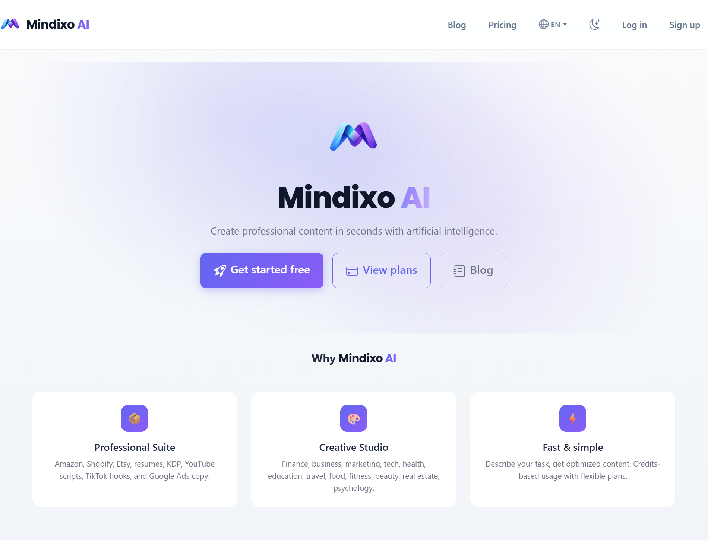
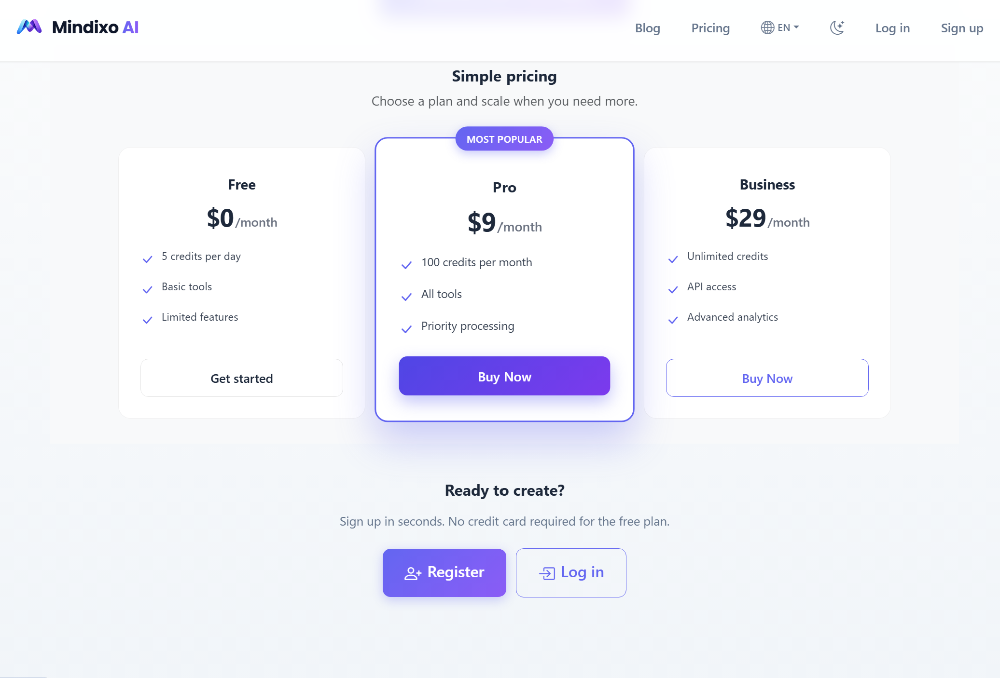
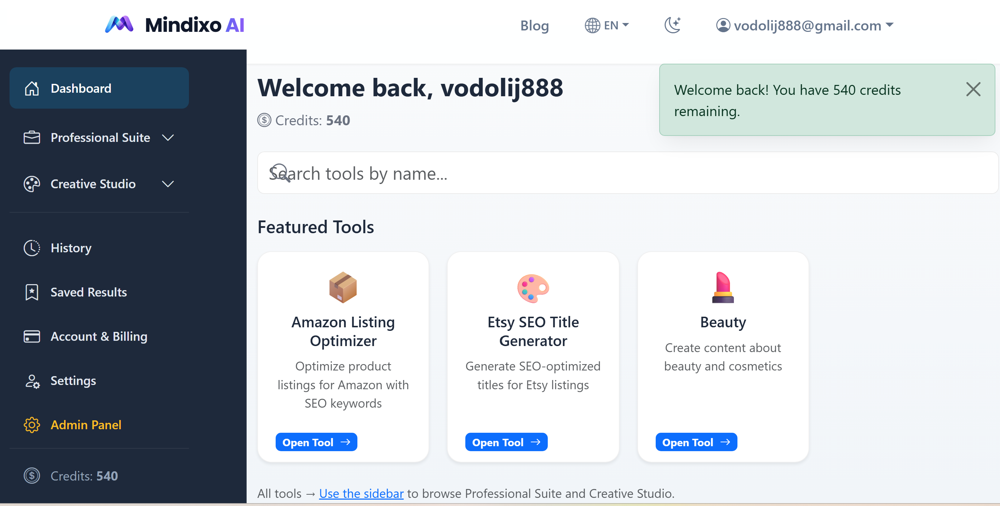

# MindixoAI — Full-Stack AI Multi-Tool SaaS Platform

> **Full-stack AI SaaS prototype** — authentication, dashboard, credits, pricing, i18n, modular tools, branding, and SEO-ready structure in one Flask codebase.

MindixoAI is a **portfolio-grade local demo**: it shows how a multi-tool AI product can be organized end-to-end **without claiming production deployment**.

---

## 📸 Screenshots

<p align="center">
  
  
</p>

<p align="center">
  
</p>

<p align="center"><em>Landing · Pricing · Dashboard</em></p>

---

## 🚀 Key Features

| | |
| --- | --- |
| 🏠 **Landing page** | Marketing entry with clear paths to tools and pricing |
| 🔐 **Login & registration** | User accounts powered by **Flask-Login** |
| 📊 **User dashboard** | Authenticated workspace for tools and account flows |
| 💎 **Credit-based usage** | Usage metering aligned with SaaS patterns |
| 💰 **Pricing page** | Plans and hooks for payment integration |
| 🧩 **Modular AI tools** | Structure built for extension and maintenance |
| 🎯 **Tool niches & categories** | Multiple domains (e.g. finance, marketing, KDP, health, and more) |
| 🤖 **OpenAI integration** | Server-side generation; model configurable (e.g. `gpt-4o-mini`) |
| 🌍 **Multilingual UI** | **Flask-Babel** with several locales |
| 🔗 **SEO-friendly URLs & sitemap** | Per-language routes and **`/sitemap.xml`** support |
| 🎨 **Branding configuration** | Centralized naming, theme, and assets |
| 🛡️ **Admin panel structure** | Administrative UI scaffolding |
| 💳 **Billing / payments (structure)** | **Stripe**-oriented checkout & customer portal code paths |
| 🗄️ **SQLite (local)** | Default DB under **`instance/`** — no cloud DB required for demos |
| ⚡ **Flask backend** | Blueprints, services, modular packages |
| 🖥️ **HTML · CSS · JavaScript** | **Jinja2** templates and static assets |

---

## 🧰 Tech Stack

| Layer | Stack |
| --- | --- |
| **Language** | Python |
| **Framework** | Flask |
| **Database** | SQLite (default local demo) |
| **Templates** | Jinja2 |
| **Frontend** | HTML, CSS, JavaScript |
| **AI** | OpenAI API |
| **Auth** | Flask-Login |
| **i18n** | Flask-Babel |
| **Payments** | Stripe (dependency + service layer — configure keys for real checkout flows) |

---

## 🏗 Architecture

High-level map of the main folders:

| Directory | Role |
| --- | --- |
| **`backend/`** | Core logic: services (OpenAI, payments), domain modules (auth, users, billing, admin, AI, credits), utilities |
| **`frontend/`** | UI organization (layouts, pages, features, components, styles, i18n notes) |
| **`modules/`** | AI tool scaffolding & templates (`modules/ai-tools/`) |
| **`tool_modules/`** | Pluggable niche/tool implementations loaded by the app |
| **`templates/`** | Jinja2 HTML — base, auth, dashboard, pricing, admin, tools |
| **`static/`** | CSS, JavaScript, images |
| **`config/`** | Centralized config (app, AI, payments, env helpers) |
| **`branding/`** | App name, theme, branding assets |
| **`translations/`** | Babel `.po` catalogs for multiple languages |
| **`docs/`** | Installation, customization, deployment, architecture guides |

**Entry point:** `app.py` — wires config, database, Babel, login, and blueprints.

---

## ⚙️ Setup (local)

1. **Create a virtual environment**

   ```bash
   python -m venv venv
   ```

2. **Activate it**

   **Windows (PowerShell / CMD):**

   ```bash
   venv\Scripts\activate
   ```

   **Linux / macOS:**

   ```bash
   source venv/bin/activate
   ```

3. **Install dependencies**

   ```bash
   pip install -r requirements.txt
   ```

4. **Environment file**

   ```bash
   copy .env.example .env
   ```

   On Linux / macOS: `cp .env.example .env`

5. **Edit `.env`** — minimum for a working demo:

   | Variable | Purpose |
   | --- | --- |
   | `SECRET_KEY` | Session security |
   | `OPENAI_API_KEY` | Real AI generation |

   **Optional / feature-specific:**

   - `OPENAI_MODEL` — e.g. `gpt-4o-mini`
   - `STRIPE_SECRET_KEY` / `STRIPE_PUBLISHABLE_KEY` — payment flows
   - `DATABASE_URL` — omit to use default SQLite at `instance/users.db`

6. **Run**

   ```bash
   python app.py
   ```

7. **Open** → [http://127.0.0.1:5000](http://127.0.0.1:5000)  
   (`http://localhost:5000` works the same locally.)

---

## 🔐 Security Notes

- **`.env` is git-ignored** — never commit secrets.
- Keep **OpenAI**, **Stripe**, and **`SECRET_KEY`** only in local or secure deployment config.
- This project is a **local portfolio / demo** baseline — treat credentials and sessions carefully if you expose it beyond your machine.

---

## ⚠️ Current Limitations

- **Local demo** by default — **not** presented here as production-deployed.
- **Payments** need proper Stripe (or alternative) configuration and sandbox testing.
- **Real AI output** requires a valid **OpenAI API key** and account limits.
- **No cloud database** out of the box — SQLite locally unless you set `DATABASE_URL`.

---

## 🛣 Future Improvements

- ☁️ **Deployment** — managed hosting, HTTPS, environment-specific config
- 🐘 **PostgreSQL** (or another production DB) instead of default SQLite
- 💳 **Full Stripe checkout** — products, webhooks, subscription lifecycle in production
- 🔒 **Production auth hardening** — rate limits, CSRF review, session policies
- 🤖 **More AI tools** — extra niches and prompts
- 📈 **Admin analytics** — usage and revenue visibility
- 📋 **Subscription management** — self-service plan changes
- 🧪 **Automated tests** — unit & integration coverage
- 🔄 **CI/CD** — lint, test, deploy pipelines

---

## 💼 Business Value

MindixoAI works as a **reusable SaaS foundation**: branding, auth, credits, pricing, and modular tools are laid out so you can **ship niche AI products faster** — swap copy, tools, and prompts while keeping the same core architecture.

---

## 🎯 Portfolio Relevance

| Focus | What this repo shows |
| --- | --- |
| **Full-stack AI product** | Web structure, auth, credits, AI integration |
| **SaaS product building** | Pricing, billing hooks, dashboard, extensible modules |
| **AI creation workflows** | OpenAI-backed flows with niche/tool organization |
| **AI automation** | Prompt-driven tools, pluggable modules, scalable patterns |

Ideal for **employers**, **freelance clients**, and **GitHub** visitors who want a concrete full-stack AI SaaS sample — honestly scoped as a **local prototype**, not a live production product.

---

## 📚 Additional Documentation

See **`docs/`** for installation, customization, deployment notes, how to add tools, change branding, and architecture details.

---

## License

MIT License
